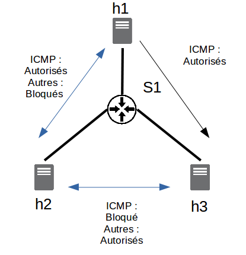

<center> <h1>A la découverte de SDN</h1> </center>

Ce TP doit vous permettre de comprendre un peu mieux le fonctionnement de SDN, ainsi que son intérêt et ses applications possibles à travers :
* l'utilisation d'un émulateur de réseau virtuel (Mininet) ;
* l'analyse du protocole Openflow ;
* l'utilisation d'un contrôleur SDN : Ryu (bien entendu, il ne s'agit que d'un contrôleur et de nombreux autres sont disponibles sur le marché : ONOS, OpenDayLight, etc );
  - le développement de nouvelles applications
  - découverte de l'API REST de Ryu
 
Notez que vous allez déployer un environnement basé sur la technologie Docker, ceci a pour but de 1) vous présenter la technologie NFV 2) pratiquer Docker de manière plus approfondie.

**Important:** A la fin de la session, veuillez m'envoyer un rapport répondant aux questions posées dans ce TP à l'adresse : romain.dulout@univ-eiffel.fr

## Prérequis (15 minutes max)

**Remarque** Cette partie peut être sautée par les personnes ayant des connaissances sur les principes et commandes de base de docker (l'idée de ce TP n'étant pas de vous former à docker et au devops de manière générale mais de vous introduire quelques concepts de la blockchain). 

Qu'est-ce que docker ? 

Docker est une plateforme de conteneurisation open-source qui permet d'emballer des applications et leurs dépendances dans des conteneurs légers, portables et isolés. En d'autres termes, il s'agit de machines virtuelles beaucoup plus légères, que l'on appelle des conteneurs lors de leurs phases d'exécution. Chaque conteneur docker partage le même noyau du système d'exploitation, là où les VMs émulent un système d'exploitation complet (y compris la mémoire, le stockage et le processeur).

Les conteneurs Docker sont autonomes, ce qui signifie qu'ils incluent tout ce dont une application a besoin pour s'exécuter, y compris le code, les bibliothèques et les configurations.

D'un point de vue technique, Docker offre de nombreux avantages en simplifiant notamment le déploiement et la gestion des applications, car les conteneurs peuvent être exécutés de manière cohérente sur n'importe quelle infrastructure compatible Docker (serveur, hôtes MAC OS, windows, linux) offrant une grande portabilité. 

Enfin, Il affiche une efficacité et une flexibilité accrues, car les conteneurs peuvent être rapidement déployés, mis à jour et réduits, tout en garantissant l'isolation des applications.

Il est aujourd'hui l'une des technologies centrales de l'approche DevOps (https://about.gitlab.com/topics/devops/), que tout nouveau développeur sur le marché se doit de connaître. 

### Installation de Docker

- **Etape 1:** Installez Docker sur votre machine locale.

 Suivez le guide d'installation officiel de votre système d'exploitation (https://docs.docker.com/engine/install/ubuntu/), ou si vous utilisez Ubuntu/Debian, exécutez les fichiers d'installation du dossier 'install'.

  ```shell
  # Example for Linux (Ubuntu)
  sudo apt-get update
  sudo apt-get install docker-ce

```

Pour vérifier que Docker est correctement installé sur votre machine, vous pouvez utiliser la commande suivante :

```shell
docker run hello-world
```
Dans cette ligne de commande :
  1. `docker` indique à votre système d'exploitation que vous utilisez le programme docker
  2. `run` est l'une des différentes sous-commandes proposées par docker pour créer et exécuter un conteneur docker.
  3. `hello-world` est utilisé pour indiquer à docker que vous utilisez une image spécifique qui sera chargée dans le conteneur.

### Télécharger (pull) et exécuter (run) une image Docker 

- **Étape 1:** Téléchargez (pull) une image Docker.

  Téléchargez l'image Docker "nginx".

   ```shell
  docker pull nginx
  ```

  - **Étape 2:** Lancez un conteneur NGINX.

  Démarrez un conteneur NGINX en mode détaché.

  ```shell
  docker run -d -p 8080:80 nginx
  ```

- **Étape 3:** Accédez au serveur web NGINX.

  Ouvrez un navigateur web et naviguez jusqu'à `http://localhost:8080`.

Vous venez de lancer votre premier environnement conteneurisé, à partir de l'image NGINX (téléchargée depuis dockerhub, librairie en ligne qui contient l'ensemble des images docker).

Nous allons voir maintenant comment créer vos propres images Docker.

### Construire son image docker

- **Étape 1:** Créez un répertoire pour votre projet Docker.
- **Étape 2:** Créez un fichier Dockerfile avec les instructions pour construire un serveur web personnalisé en utilisant NGINX. (exemple de fichier index.html dans ce dossier)

  ```Dockerfile
  # Utilisez l'image de base officielle de NGINX
  FROM nginx

  # Copiez vos fichiers HTML personnalisés à la racine du document NGINX
  COPY custom-html-files /usr/share/nginx/html
  ```

- **Étape 3:** Construisez l'image Docker personnalisée (qui s'appelera my-web-server) là où vous avez votre Dockerfile.

  ```shell
  docker build -t my-web-server .
  ```

- **Étape 4:** Exécutez un conteneur à partir de votre image personnalisée.

  ```shell
  docker run -d -p 8081:80 my-web-server
  ```

- **Étape 5:** Accédez au serveur web personnalisé.

  Ouvrez un navigateur web et naviguez jusqu'à `http://localhost:8081`.

Vous venez de créer votre image NGINX custom, et lancer ce nouvel environnement conteneurisé.
Nous allons à présent lancer des environnements plus complexes à l'aide de l'orchestrateur de conteneurs docker : docker-compose.

### Orchestration de plusieurs conteneurs docker

- **Étape 1:** Installez Docker Compose.

  Suivez le guide d'installation officiel de Docker Compose sur votre système d'exploitation (ou vous pouvez essayer d'exécuter le script situé dans ce dossier). 

- **Étape 2:** Créez un répertoire de projet Docker Compose.

  Créez un répertoire nommé `my-docker-app` pour votre projet Docker Compose.

- **Étape 3:** Définissez un fichier YAML pour Docker Compose.

Créez un fichier nommé `docker-compose.yml` dans le répertoire du projet et définissez-y des services (qui sont nos conteneurs). Par exemple, créez des services pour une application web et une base de données (par exemple, WordPress et MySQL).


  ```yaml
  version: '3'
  services:
    wordpress:
      image: wordpress:latest
      ports:
        - "8080:80"
      environment:
        WORDPRESS_DB_HOST: db
        WORDPRESS_DB_USER: exampleuser
        WORDPRESS_DB_PASSWORD: examplepassword
        WORDPRESS_DB_NAME: exampledb
    db:
      image: mysql:5.7
      environment:
        MYSQL_ROOT_PASSWORD: examplepassword
        MYSQL_USER: exampleuser
        MYSQL_PASSWORD: examplepassword
        MYSQL_DATABASE: exampledb
  ```

- **Étape 4:** Démarrez les services Docker Compose.

  Exécutez la commande suivante dans le répertoire du projet pour démarrer les services définis en mode détaché.

  ```Shell
  docker-compose up -d
  ```

- **Étape 5:** Accédez à l'application.

  Ouvrez un navigateur web et naviguez vers `http://localhost:8080`.

Vous venez de lancer un environnement complexe dans lequel plusieurs services (conteneurs) interdépendant sont initialisés puis exécutés. 
Chaque conteneur est décrit dans la partie service du fichier docker-compose.yml. Vous pouvez modifier la valeur de chaque clé pour customiser les différents services décrits dans ce fichier.

Vous n'aurez pas dans la suite du TP besoin de connaître l'ensemble de ces commandes, retenez en simplement la philosophie.

## 0. Brève introduction théorique : Qu'est-ce que SDN ? ##

La technologie SDN (Software Defined Networking) est apparue comme une technologie disruptive qui est progressivement adoptée par de nombreuses entreprises et ce pour un large éventail de cas d'usage.

Trois questions permettent de comprendre cette technologie et ses avantages :

**Q.I** Quelles sont les principales différences entre une architecture de réseau traditionnelle et une architecture de réseau basée sur SDN ?

**Q.II** Quels sont les principaux avantages de cette technologie/nouvelle architecture de réseau ?

**Q.III** Quels sont les différents modèles SDN ?

Note : Pour répondre à ces questions, vous pouvez éventuellement utiliser ces deux sources d'information : 
https://www.vmware.com/fr/topics/glossary/content/software-defined-networking.html et 
https://www.silicon.fr/hub/colt-hub/10-choses-a-savoir-pour-comprendre-le-sdn

## 1. Mininet

Mininet, basé sur la virtualisation des OS, est un émulateur permettant de créer et d'interagir localement avec un réseau virtuel.

### 1.1 Mise en route

Dans notre exemple, Mininet sera déployé au sein d'un conteneur docker.

Pour ce faire, vous pouvez utiliser l'image docker suivante : https://hub.docker.com/r/iwaseyusuke/mininet/ (**pour pouvoir utiliser xterm -terminal pour les hôtes au sein du réseau virtuel- vous devrez utiliser la ligne de commande proposée par le créateur de ce répertoire, incluant *--privileged -e DISPLAY \ -v /tmp/.X11-unix:/tmp/.X11-unix \ -v /lib/modules:/lib/modules*)

Vous devrez le récupérer et le faire tourner dans un réseau personnalisé (**vous devez créer un réseau bridge**).

Une fois le docker lancé, vous devriez pouvoir lancer Mininet avec la commande suivante : `mn`

Une fois que vous avez tapé cette commande, vous êtes dans le shell Mininet. Il y a plusieurs commandes qui peuvent être utiles :

```console
mininet> exit #sortir de mininet

mininet> help # pour afficher les commandes utilisables avec cet émulateur

mininet> h1 ping h2 # montre comment faire un ping de h1 à h2
```

**Q.1** Quelle est la topologie par défaut de mininet (combien de  openflow et combien d'hôtes) ?

**Q.2** A quoi servent les commandes pingall, iperf, xterm, ifconfig, dump, links et net dans mininet ?

**Pour activer l'utilisation de xterm dans le conteneur docker, vous devrez utiliser la commande suivante `xhost +si:localuser:root`**.

**Q.3** Les switchs de votre instance mininet sont configurés comme "learning switch" par défaut.
  * Qu'est-ce qu'un "learning switch"? Quel est le résultat de pingall lorsque le learning switch est utilisé ?
  * Quittez mininet et redémarrez en désactivant le contrôleur (`--controller none`). Quel est le résultat de pingall ? Quel est donc le rôle du contrôleur dans une architecture SDN ?

*Note:* Dans cette partie comme dans le reste de ce tutoriel, quelques commandes peuvent être utilisées, en particulier `mn -c` qui vous permettra de nettoyer le mininet en cas de problème.

*Note* : La commande que nous utiliserons plus tard aura d'autres paramètres :
`sudo mn --switch=ovsk,protocols=OpenFlow13`

Nous verrons dans les sections suivantes pourquoi le type de switch et le type de protocole sont importants.

### 1.2 Définition de topologies spécifiques

Mininet permet nativement de définir un grand nombre de topologies en utilisant différents arguments.
Jusqu'à présent, la topologie que nous avons utilisée est composée de deux hôtes (h1,h2) et d'un switch (s1).

La commande que nous avons utilisée jusqu'à présent correspond donc à une topologie arborescente avec une profondeur de 1 et un fanout de 2 utilisateurs et aurait pu être écrite comme suit :
`sudo mn --topo=tree,depth=1,fanout=2`

**Q.4** Si nous modifions maintenant cette topologie et créons une topologie avec une profondeur de 3 et un fanout de 4, combien y a-t-il de switchs ? Combien d'hôtes ? Combien de liens et enfin combien de contrôleurs ? A quel switch l'hôte 25 est-il connecté ? (Pour répondre à cette question, vous devrez utiliser les différentes commandes associées à Mininet que vous avez découvertes dans la partie 1.1).

Mininet dispose d'une API python. Grâce à cela, en utilisant cette API python, il est possible en quelques lignes de créer vos propres topologies personnalisées.

 
 <figcaption>Fig.1 - Architecture à mettre en œuvre</figcaption>


Nous allons maintenant essayer de créer notre propre topologie correspondant à l'image ci-dessus. Une topologie simple composée de 3 switchs et de trois hôtes.

Pour créer cette architecture, vous pourrez vous inspirer du code ci-dessous.

```ruby
from mininet.topo import Topo

class CustomTopo(Topo):
    "Simple topology example."

    def __init__(self):
        "Create custom topo."

        # Initialize topology
        Topo.__init__(self)

        # Add hosts and switch
        s1 = self.addSwitch('s1')
        h1 = self.addHost('h1')

        # Add links
        self.addLink(h1,s1)

topos = {'customtopo': (lambda: CustomTopo())}

```

Notez que 3 APIs sont essentielles à la définition d'une topologie : `addSwitch`, `addHost` et `addLink`.

**Q.5** Créez un fichier python dans lequel vous utiliserez ces différentes fonctions pour créer une topologie qui correspondra à la topologie décrite dans la figure ci-dessus.

Une fois ce code écrit, vous pourrez l'exécuter avec mininet pour vérifier qu'il fonctionne correctement.

Pour ce faire, vous pourrez utiliser pour la première fois le contrôleur qui sera présenté et utilisé dans la suite de ce tutoriel : Ryu. Il existe de nombreux contrôleurs SDN, parmi lesquels ONOS et OpenDayLight sont les plus connus. Cependant, Ryu est aussi un contrôleur utilisé, facile à apprendre et à installer. C'est pour cette raison qu'il a été choisi pour ce tutoriel, et c'est un bon moyen d'apprendre la programmation d'applications réseau. 

Ce que nous allons faire ici est simple :
  * Utiliser le contrôleur Ryu dans son fonctionnement de base, 

  * Indiquer à mininet que le contrôleur à utiliser n'est pas le contrôleur par défaut mais le contrôleur Ryu (nous allons simplement "brancher" le contrôleur Ryu sur la topologie que nous venons de définir).

**Le contrôleur Ryu, en tant que Mininet, fonctionnera dans son propre conteneur Docker**

Vous devrez donc utiliser une image Docker d'un contrôleur Ryu (https://hub.docker.com/r/osrg/ryu) et l'exécuter dans le même réseau local Docker.

Notez que vous pouvez obtenir l'adresse IP du conteneur Docker, dans ce sous-réseau, avec la commande suivante : `ip a`

Une fois ce conteneur lancé, vous devriez pouvoir lancer le contrôleur à l'aide de la commande suivante :
```console
ryu-manager ryu/ryu/app/simple_switch_13.py
```

Une fois cela fait, dans le conteneur Mininet, vous devrez indiquer à votre réseau virtuel d'utiliser ce contrôleur :

```console
sudo mn --custom <lien vers fichier custom>.py --topo customtopo --controller remote,ip=<IP_adress of_the_Ryu_container> --link tc --switch=ovsk,protocols=OpenFlow13
```

*Note:* L'option `--link tc` devrait permettre de spécifier différents types d'options concernant les liens (bande passante, délai, perte) et est nécessaire.

**Q.6-7** Maintenant que cette topologie est en place, effectuez un test : Quel est le résultat d'un `pingall` ?

**Q.8** En utilisant une commande que vous avez vue plus tôt, spécifiez les liens entre les différentes interfaces (s1-eth1:h1-eth0, etc.). En modifiant votre fichier de topologie personnalisé, supprimez le lien entre s1 et s2. Essayez de refaire un `pingall`, que se passe-t-il ?

Comme vous pouvez le voir dans le dossier `ryu/ryu/app/`, et comme nous le verrons dans la suite de ce tutoriel, il y a beaucoup d'exemples différents d'utilisation de Ryu et des contrôleurs et commutateurs. Nous pouvons observer que certains d'entre eux (notamment simple_switch_stp.py) proposent une utilisation du STP.

**Q.9** Qu'est-ce que le Spanning Tree Protocol (STP) ? Quel peut être son intérêt ici ? Pourrait-il nous aider à corriger le problème que nous avons découvert ? 

 ## 2. Openflow ###

Comme vous le savez, une architecture SDN est composée de trois couches principales : Application - Contrôle - Infrastructure. Le protocole le plus courant pour la communication entre la couche contrôle (contrôleurs SDN) et la couche infrastructure (commutateurs) est Openflow. Il s'agit d'un protocole de communication qui permet au contrôleur d'avoir accès au "Forwarding plane" des switchs et des routeurs. Différentes versions de ce protocole existent et dans ce tutoriel, comme vous l'avez peut-être déjà compris, nous nous concentrerons sur la version 1.3.

### 2.1 Retour au fonctionnement des switchs traditionnels ###

**Q.10** Rappelez le fonctionnement des commutateurs L2 traditionnels (c'est-à-dire les commutateurs de niveau 2 du modèle OSI) :
  * Y a-t-il une séparation entre le plan de contrôle et le plan de données ?
  * Quel type de données la table de transfert contient-elle ? Quel type de données est traité au niveau 2 ?
  * Comment cette table est-elle mise à jour ?

### 2.2 Switchs SDN basés sur Openflow

Nous allons maintenant essayer de comprendre quelle est la principale différence entre ces switchs traditionnels et les switchs openflow.

Pour ce faire, nous allons procéder en deux temps, d'abord théorique puis pratique.

**Q.11** Pour commencer, listez les principaux messages qu'OpenFlow doit permettre d'échanger (Hello, PacketIn, PacketOut, FlowRemoved, Echo, FlowMod, EchoReq, EchoRes). N'oubliez pas d'indiquer l'expéditeur (contrôleur ou switch) et le destinataire (contrôleur ou switch) ainsi que leur objectif. Pour cela, vous pouvez utiliser la documentation ici : https://overlaid.net/2017/02/15/openflow-basic-concepts-and-theory/. N'oubliez pas que nous travaillons actuellement avec la version 1.3.

Nous allons maintenant essayer de voir ce qu'elle peut faire en pratique. Pour ce faire, nous devons d'abord redémarrer un contrôleur Ryu avec un interrupteur de niveau 2 :

`ryu-manager ryu/ryu/app/simple_switch_13.py`

Nous allons ensuite lancer l'émulateur Mininet avec une topologie linéaire composée de 6 switchs :

`sudo mn --controller=remote,ip=<IP> --switch=ovsk,protocols=OpenFlow13 --topo=linear,6`

Ce que nous voulons faire maintenant, c'est observer les échanges entre les différents switchs, et entre les switchs et le contrôleur.

Pour cela, nous allons lancer Wireshark et observer les échanges qui se produisent entre les switchs.

**Note : Wireshark doit être lancé avec sudo. S'il n'est pas installé sur votre machine locale vous devez le télécharger!**.

Exécutez maintenant la commande pingall.

**Q.12** Quels types de commandes OpenFlow sont capturés par Wireshark, d'après la partie théorique, quel est leur rôle ?

**Q.13** Si vous exécutez à nouveau la commande pingall, quelle différence observez-vous par rapport à la question précédente ? Pourquoi ?

**Q.14** Comment fonctionnent ces switchs SDN ? Quelle est la principale différence avec les switchs traditionnels (dispositifs hérités fonctionnant sans SDN) ?

**Q.15** Quel type de données est traité ici par le plan de données (voir le contenu de packetIn et packetOut) ? Quel est le rôle du switch ici ?

En utilisant l'outil en ligne de commande `ovs-ofctl`, vous pouvez également superviser et gérer les switchs OpenvSwitch du réseau que vous venez de créer. Il est ainsi possible de récupérer des informations sur l'état actuel d'un OpenvSwitch, y compris ses caractéristiques, sa configuration et ses tables d'entrée. En effet, le ou les commutateurs virtuels utilisés ici sont des commutateurs OpenvSwitch. Comme nous aurons accès à différentes informations via cette interface dans la partie 3, il semble intéressant de comprendre comment elle fonctionne.

**Qu'est-ce qu'un OpenvSwitch, et que peut-on faire avec ? A quoi servent les composants et outils ovs-vsctl, ovs-dpctl, ovsdb-server et ovs-ofctl ? (docs.openvswitch.org/fr/latestest/intro/what-is-ovs/)

**Q.17** Quelles informations sont utilisées pour récupérer les commandes suivantes, par exemple ?

**Note : si vous voulez ouvrir un second terminal sur un conteneur en cours d'exécution, vous pouvez utiliser la commande suivante : `docker exec -it nom-du-conteneur /bin/bash`**

```console
$ ovs-vsctl show
$ ovs-ofctl -O OpenFlow13 show s1
$ ovs-ofctl -O Openflow13 dump-flows s1
```
## 3. Ryu ##

Maintenant que nous avons compris comment utiliser l'émulateur Mininet (création d'un réseau virtuel) et les fondamentaux d'OpenFlow (type de messages échangés, rôle du contrôleur) nous allons essayer de développer des applications au sein du contrôleur Ryu. Nous nous concentrerons sur l'interface Sud et les échanges entre le contrôleur et l'infrastructure et découvrirons quelques unes des possibilités offertes par Ryu :
  * Gui 
  * STP
  * Ajouter des fonctionnalités au contrôleur :
    - Mise en place d'un contrôleur de niveau 2
    - Définition des règles de niveau 3
    - Définition des règles de niveau 4
  * Ryu et l'API REST
    - Pour commencer
    - Firewalling (pare-feu)
    - QoS

### 3.0 Gui Topology

Tout d'abord, pour réutiliser les commandes/concepts précédent, nous allons essayer d'afficher le Topology Viewer Gui offert par Ryu : https://ryu.readthedocs.io/en/latest/gui.html

Cette topologie Gui peut être lancée avec la commande suivante (**avec le contrôleur déjà lancé**) dans le conteneur Ryu : `ryu run --observe-links ryu/app/gui_topology/gui_topology.py`

Cette topologie Gui s'exécute sur le port 8080. Nous voudrons l'afficher à l'adresse : http://localhost:8080.

Vous devrez donc connecter le port 8080 du conteneur Ryu au port 8080 de votre machine.

Une fois que cela est fait et que la topologie est affichée dans votre navigateur, appelez-moi pour me montrer que cela fonctionne.

### 3.1 Retour au protocole Spanning Tree

Dans la première partie de ce tutoriel, nous avons vu qu'en présence de redondances, le réseau pouvait être perturbé. Nous allons utiliser ici une application possible de Ryu, le protocole Spanning Tree, pour résoudre ce problème. Pour ce faire, nous travaillerons à nouveau avec la topologie que vous avez définie dans la partie 1.2.

Ainsi, nous allons :
  - dans un premier terminal, lancer une application SDN Ryu basée sur le protocole STP : `ryu-manager simple_switch_stp_13.py` ;
  - dans un second terminal, lancer la commande mininet pour utiliser la topologie que vous avez définie en 1.2.
  
**Note : Le fichier simple_switch_stp_13.py est dans le dossier my_apps ! Vous pouvez 1) utiliser docker cp pour le copier dans votre conteneur ou 2) l'installer dans le conteneur et git cloner ce projet**. 

**Q.18** Si vous regardez le terminal dans lequel le contrôleur Ryu a été lancé, vous pouvez voir qu'un certain nombre de retours sont déjà affichés. Quels sont-ils (LISTEN, BLOCK, LEARN, etc.) ? Faites l'inventaire de l'état des ports des différents switchs.

**Dans le container Mininet, affichez la liste des requêtes échangées sur le port eth2 de s1 : `tcpdump -i s1-eth2 arp`. Maintenant, toujours dans Mininet, essayez d'envoyer un ping à h1 avec h2. Attendez une minute, que voyez-vous ?

**Si vous désactivez l'interface eth2 de s2 (*ip link set dev s1-eth2 down*), qu'arrive-t-il au contrôleur ? Quel est l'état des ports maintenant ? Que peut-on conclure à propos du STP ?

**Q.21** Si nous rallumons eth2, que se passe-t-il ? Que pouvons-nous conclure à propos du STP ?

### 3.2 Ajouter des fonctionnalités au contrôleur

Jusqu'à présent, nous n'avons utilisé que des fonctionnalités prédéfinies de Ryu avec des implémentations existantes et disponibles. Ce que nous allons faire maintenant, à travers diverses implémentations pratiques, est d'essayer de comprendre comment Ryu fonctionne et de mettre en action quelques nouvelles fonctionnalités.

*Note : Dans un premier temps, une topologie simple composée d'un switch et de trois hôtes sera utilisée dans cette partie.

#### 3.2.1 Implémentation d'un switch de niveau 2 ####

Pour commencer, nous allons essayer de comprendre comment un contrôleur de switch de niveau 2 est implémenté. Pour ce faire, nous partirons du code présent dans `my_apps/basic_switch.py`. Comme nous allons modifier ce script, vous pouvez en faire une copie pour garder une base de travail.

Si vous ouvrez le fichier `my_apps/basic_switch.py` ou la copie que vous venez de faire, vous verrez que ce fichier contient plusieurs éléments essentiels.

Tout d'abord, les différentes bibliothèques nécessaires au fonctionnement de l'application :
```ruby
from ryu.base import app_manager    # permet d'accéder à l'application

# différents éléments permettant de capturer des événements correspondant à la réception d'un packet OpenFlow
from ryu.controller import ofp_event    
from ryu.controller.handler import CONFIG_DISPATCHER, MAIN_DISPATCHER
from ryu.controller.handler import set_ev_cls

from ryu.ofproto import ofproto_v1_3    # spécification de la version d'OpenFlow à utiliser
from ryu.lib.packet import packet
from ryu.lib.packet import ethernet
from ryu.lib.packet import ether_types
...
```

Mais aussi la définition de la classe (dérivée d'app manager) ainsi que le choix du protocole OpenFlow utilisé (ici 1.3) et la définition du constructeur.

Nous pouvons observer que cette classe est composée de trois fonctions principales, une première qui permet de gérer les *caractéristiques* des switchs, une seconde qui permet d'ajouter un nouveau flux à un switch et une troisième qui permet de gérer les *PacketIn*. Ce que nous allons essayer de faire ici est de comprendre et de modifier la fonction *PacketIn*.

**Q.22** En utilisant les différentes fonctions que vous avez listées dans **2.2.1.**, essayez de comprendre la fonction *PacketIn*. Quelle est la commande que vous avez listée précédemment et que vous retrouvez ici ? Quel est son but ?

**Q.23** Lancez ce contrôleur Ryu (`ryu run my_apps/basic_switch.py`) et une topologie Mininet basique et observez les trames échangées dans Wireshark. Si vous exécutez pingall comme vous l'avez fait dans la partie **2.2**, qu'observez-vous ? Comment expliquez-vous cette différence ? Qu'est-ce qui semble manquer dans le programme `basic_switch.py` ?

Pour terminer cette partie, récupérez dans le fichier `ryu/ryu/app/simple_switch_13.py` la partie manquante du code et vérifiez qu'elle fonctionne correctement.

#### 3.2.2 Définition des règles de niveau 3 ####

Nous nous sommes concentrés jusqu'à présent sur les switchs et la prise de décision de niveau 2 (OSI) en utilisant un exemple d'application proposé par Ryu pour implémenter un contrôleur gérant ce type d'équipement. Nous allons maintenant essayer de modifier le code existant pour transformer l'application en une application de niveau 3.

**Q.24** Pour commencer, rappelez la différence entre un commutateur de niveau 2 et un commutateur de niveau 3. Quel est l'intérêt de mettre en place des règles de gestion de flux de niveau 3 ?

*Note : Pour répondre à cette question, vous pouvez utiliser https://www.aussiebroadband.com.au/blog/difference-layer-3-layer-2-networks/ 

Dans la fonction *PacketIn*, ce que nous voulons faire est d'envoyer une nouvelle règle au commutateur pour empêcher un nouveau packetIn de se produire. Cependant, cette fois-ci, cette règle ne sera pas au niveau MAC mais au niveau IP.
Pour ce faire, nous allons modifier la partie de la fonction *PacketIn* correspondant au `FlowMod` :

```ruby
# install a flow to avoid packet_in next time
if out_port != ofproto.OFPP_FLOOD:
   match = parser.OFPMatch(in_port=in_port, eth_dst=dst, eth_src=src)
   # verify if we have a valid buffer_id, if yes avoid to send both
   # flow_mod & packet_out
   if msg.buffer_id != ofproto.OFP_NO_BUFFER:
       self.add_flow(datapath, 1, match, actions, msg.buffer_id)
       return
   else:
       self.add_flow(datapath, 1, match, actions)
```

Comme vous pouvez le voir ci-dessous, ce que nous allons faire est d'ajouter une nouvelle condition, s'il s'agit d'un paquet de type IP, nous allons récupérer les informations concernant la source et la destination

```ruby
# check IP Protocol and create a match for IP
if eth.ethertype == ether_types.ETH_TYPE_IP:
    ip = pkt.get_protocol(ipv4.ipv4)
    srcip = ip.src
    dstip = ip.dst

    # lIGNE A MODIFIER
    match = parser.OFPMatch(eth_type=ether_types.ETH_TYPE_IP,IP_SRC=srcip,IP_DEST=dstip)

    # verify if we have a valid buffer_id, if yes avoid to send both
    # flow_mod & packet_out
    if msg.buffer_id != ofproto.OFP_NO_BUFFER:
        self.add_flow(datapath, 1, match, actions, msg.buffer_id)
        return
    else:
        self.add_flow(datapath, 1, match, actions)
```

Remplacer par le code ci-dessus :

```ruby
   match = parser.OFPMatch(in_port=in_port, eth_dst=dst, eth_src=src)
   # verify if we have a valid buffer_id, if yes avoid to send both
   # flow_mod & packet_out
   if msg.buffer_id != ofproto.OFP_NO_BUFFER:
       self.add_flow(datapath, 1, match, actions, msg.buffer_id)
       return
   else:
       self.add_flow(datapath, 1, match, actions)
```

Vous devez modifier la ligne de correspondance pour que la règle ne s'applique plus à une adresse MAC mais à une adresse IP :

```ruby
match = parser.OFPMatch(eth_type=ether_types.ETH_TYPE_IP,IP_SRC=srcip,IP_DEST=dstip)
```
Sur cette ligne, vous ne devrez modifier que les mots-clés *IP_SRC* et *IP_DEST*. Pour connaître les mots-clés à utiliser, vous pouvez utiliser : https://osrg.github.io/ryu-book/en/html/openflow_protocol.html.

**Une fois cette modification effectuée, vérifiez qu'elle a bien été prise en compte. Pour ce faire 
  * redémarrez le contrôleur avec le fichier que vous venez de modifier,
  * Exécutez à nouveau une configuration Mininet de base et faites un ping ; 
  * utiliser la commande `sudo ovs-ofctl -O Openflow13 dump-flows s1` pour voir si la règle que vous venez de définir apparaît.

OpenFlow présente de nombreux avantages. Par exemple, il est très facile d'ajouter de nouvelles règles pour modifier le comportement du commutateur et ajouter de nouvelles fonctionnalités. Par exemple, on peut décider de dupliquer tout ou partie du trafic destiné à un port vers un autre port, par exemple pour "brancher" un dispositif contrôlant le trafic.

**Q.26** En observant les différents champs d'une commande *FlowMod*, quelle partie correspond aux instructions (voir https://programmerall.com/article/60675193/) ? Quel champ est présent dans la fonction addflow ?

**Q.27** Maintenant que vous avez identifié le champ à modifier, ajoutez une nouvelle règle et dupliquez le trafic vers l'hôte 10.0.0.3.

Pour vérifier que les changements que vous venez d'effectuer fonctionnent :
  * Exécutez un contrôleur Ryu avec le programme que vous venez de modifier,
  * Exécutez Mininet avec un switch et 3 hôtes (n'oubliez pas de spécifier le protocole !),
  * Dans un troisième terminal, scannez les paquets TCP reçus par l'hôte 3 : `sudo tcpdump -i s1-eth3`,
  * Dans un quatrième terminal, examinez les paquets TCP reçus par l'hôte 2 : `sudo tcpdump -i s1-eth2`,
  * Dans Mininet, faites un ping de l'hôte 1 à l'hôte 2, vérifiez que le trafic est dupliqué et que l'hôte 3 le reçoit également.

#### 3.2.3 Définition des règles de niveau 4 ####

**Q.28** Quelle est la différence entre le niveau 3 et le niveau 4 (modèle OSI) ? Quel peut être l'intérêt de définir des règles à ce niveau ?

Un cas typique pourrait être la répartition de charge entre différents serveurs, un client suppose qu'il est connecté à l'IP de la machine X sur un port X1 alors qu'il est connecté à une machine Y sur un port Y1.

Nous allons mettre en place ce type de règle et rediriger le trafic TCP destiné à l'hôte 1 sur le port 6000 vers le port 5000 de ce même hôte.

Nous voulons donc que la règle soit X.X.X.X:6000->X.X.X.X:5000.

Nous voulons faire cette modification par défaut, c'est-à-dire que nous ne voulons pas seulement que cette règle soit appliquée lorsque nous recevons un *PacketIn* mais dans tous les cas. Nous allons donc l'ajouter à la fonction *switch_features_handler* qui correspond aux règles passées par le contrôleur au switch lors de l'initialisation.

Ce que nous aurons à faire ici se compose de deux étapes :
  * Si l'adresse IPV4 de destination est "10.0.0.1" et que le port tcp de destination est 6000 alors nous remplaçons le port de destination par 5000.
  * Dans l'autre sens, si l'adresse IP source est "10.0.0.1" et que le port TCP est 5000, nous remplaçons le port source par 6000.

Pour ce faire, nous utiliserons à nouveau la documentation sur les correspondances (https://ryu.readthedocs.io/en/latest/ofproto_v1_3_ref.html) mais aussi l'exemple suivant :

```ruby
# Add required parameters to match
match1 = parser.OFPMatch(eth_type=ether_types.ETH_TYPE_IP, ip_proto=in_proto.IPPROTO_TCP)

# Add required parameters to action
actions1 = [parser.OFPActionSetField(<INDIQUER TCP_PORT = X>),parser.OFPActionOutput(PORT_SORTIE)]

# Add a new flow
self.add_flow(datapath, 1, match, actions)
```

**Q.29** Mettez en œuvre les deux conditions à ajouter au tableau des flux et vérifiez ensuite leur fonctionnement. Pour ce faire, vous devez :
  * Exécuter le contrôleur avec votre script
  * Lancer Ryu
  * Mettre en place un serveur TCP sur le port 5000 de l'hôte 1 : `iperf -s -p 5000`.
  * Tester la bande passante TCP entre l'hôte 2 et le port 6000 de l'hôte 1 : `iperf -c 10.0.0.1 -p 6000` (si rien ne s'affiche... c'est que cela ne fonctionne pas !) 

**Q.30** Après avoir éteint le contrôleur et Mininet et décommenté les lignes *A DECOMMENTER* dans la fonction *switch_features_handler*, répétez les opérations de la question précédente. Il semble maintenant impossible d'établir une connexion, comment l'expliquez-vous ? Pour répondre à cette question, vous pouvez essayer d'analyser la table de flux de s1 : ` sudo ovs-ofctl -O OpenFlow13 dump-flows s1`.

Maintenant, ajoutez un nouveau paramètre aux fonctions *add_flow* et *parser.OFPFlowMod* (contenues dans add_flow) : hard_timeout. N'oubliez pas, dans la définition de add_flow, d'initialiser ce paramètre à 0.

Sélectionnez l'un des appels à *add_flow* que vous faites dans *switch_features_handler* et ajoutez-lui le paramètre hard_timeout, en lui donnant la valeur 10 (par exemple : *self.add_flow(datapath, 100, match, actions, hard_timeout=10)* ).

**Q.31** Redémarrez le contrôleur et Mininet et affichez la table de flux de s1, puis attendez 10 secondes et affichez à nouveau cette table de flux. Que constatez-vous ? Comment l'expliquez-vous ? Nous parlons de *idle timeout* et *hard timeout*, quelle est la différence entre les intérêts et quel est l'intérêt de ce type de fonctionnalité ?

### 3.3 Ryu et l'API REST ###

Ryu dispose d'une fonction de serveur web (WSGI) permettant de créer une API REST (et d'afficher la topologie comme nous l'avons déjà fait). Cela peut être très utile pour établir une connexion entre Ryu et d'autres systèmes ou navigateurs.

#### 3.3.1 Démarrage ####

Avant de passer à des applications plus complexes, nous allons essayer de comprendre comment fonctionne cette API REST et pourquoi elle est utile. Pour ce faire, nous commencerons, comme dans les parties 1 et 2, par travailler avec un simple switch OpenFlow13 . Cependant, cette fois-ci, les switchs seront accessibles via une API Rest.

**Q.32** Ouvrez le fichier `simple_switch_rest_13.py` dans `my_apps`, combien d'APIs semble-t-il avoir ?

Nous allons maintenant essayer d'interagir avec ces interfaces, pour cela nous allons :  
  * dans un premier terminal lancer ryu avec l'application `simple_switch_rest_13.py`.
  * dans un second terminal, lancer une version basique de Mininet (c'est à dire la première version lancée dans ce tp) (mn + controller info)

Maintenant que l'environnement est prêt, dans un troisième terminal tapez la commande :

`curl -X GET http://127.0.0.1:8080/simpleswitch/mactable/0000000000000001`

**Q.33** Que signifie *0000000000000001* ? Quelles sont les informations récupérées ? A quoi correspond-elle ? Qu'est-ce que ces deux APIs semblent permettre dans le fichier `simple_switch_rest_13.py` ?

#### 3.3.2 Mise en place de Firewall ####

Maintenant que nous avons vu que les APIs veulent nous permettre d'interagir avec le contrôleur, nous allons aller plus loin en utilisant ces APIs pour mettre en place un pare-feu.

Pour ce faire, différentes commandes seront utiles :

```console
$ curl -X PUT http://localhost:8080/firewall/module/enable/SWITCH_ID # enable firewalling

$ curl http://localhost:8080/firewall/module/status # check firewall status

$ curl -X POST -d '{"nw_src": "X.X.X.X/32", "nw_dst": "X.X.X.X/32", "nw_proto": "ICMP", "actions": "DENY"}' http://localhost:8080/firewall/rules/SWITCH_ID # Add a rule blocking ICMP packets (PING) from an A address to a B address (in a terminal)

$ curl -X POST -d '{"nw_src": "X.X.X.X/32", "nw_dst": "X.X.X.X/32", "nw_proto": "ICMP"}' http://localhost:8080/firewall/rules/SWITCH_ID # Add a rule allowing ICMP packets from an A address to a B address (in a terminal)

$ curl -X POST -d '{"nw_src": "X.X.X.X/32", "nw_dst": "X.X.X.X/32"}' http://localhost:8080/firewall/rules/SWITCH_ID # Add a rule that allows any kind of packet (in a terminal)

$ curl -X DELETE -d '{"rule_id": "X"}' http://localhost:8080/firewall/rules/SWITCH_ID # Delete the previously defined rule number X (in a terminal)

curl http://localhost:8080/firewall/ruless/SWITCH_ID # Display all the rules defined at a given time (in a terminal)

h1 ping h2 # check that ICMP packets are received 

$ wget http://X.X.X.X # check if non-ICMP packets are received (in Xterm)
```
**Note : Par défaut, lorsque le contrôleur est lancé, tous les liens sont coupés. En d'autres termes, toutes les communications sont bloquées**.

Grâce à toutes ces commandes, qui vous permettent d'accéder aux APIs du firewall, vous devriez être en mesure de compléter cette partie.

Pour cela, nous allons commencer par :
  * Lancer mininet dans un premier terminal : `sudo mn --topo single,3 --switch ovsk --controller remote`
  * Exécuter le firewall dans un second terminal : `ryu-manager --verbose ryu/ryu/app/rest_firewall.py`
  * Par défaut, le pare-feu n'est pas activé, vous devrez donc l'activer avec les deux commandes ci-dessus et vérifier qu'il est bien activé.
  * Vous pouvez également vérifier le fonctionnement du système en effectuant un ping entre deux hôtes.


 
 <figcaption>Fig.2 - Firewalling rule definition</figcaption>


Maintenant que l'environnement est en place, nous pouvons commencer à utiliser l'API Rest pour appliquer les différentes règles présentées dans la figure 2 :
  - Les paquets ICMP sont bloqués entre h2 et h3 (dans les deux sens !): Les paquets ICMP sont bloqués et le reste du trafic est autorisé.
  - entre h2 et h1 (dans les deux sens !): les paquets ICMP sont autorisés et les autres paquets sont bloqués
  - entre h1 et h1 (seulement h1 -> h3, bloqué dans l'autre sens !): Les paquets ICMP sont autorisés, les autres paquets sont bloqués.

**Q.34** Commencez par donner toutes les informations correspondant aux équipements formant le réseau : IP et MAC des hôtes et ID du switch

**Q.35** En ce qui concerne les règles :
  - Mettre en place toutes les règles demandées,
  - Vérifier qu'elles ont bien été ajoutées aux règles du commutateur,
  - Avec les commandes fournies, vérifier qu'elles fonctionnent en essayant d'échanger entre les différents hôtes. Dans le contrôleur Ryu, quel type de message pouvez-vous observer lorsqu'un paquet est bloqué ?
  - Supprimez la règle correspondant à l'interdiction de PING entre h2 et h3, vérifiez qu'il est maintenant possible pour les deux hôtes de s'envoyer des pings.

#### 3.3.3 QoS ####

Le dernier objectif de ce tutoriel est de mettre en place des règles pour gérer la qualité de service (QoS) d'abord localement (flux par flux) puis globalement.

Cette gestion de la QoS vise à permettre la priorisation de certaines applications (en particulier les applications critiques telles que la sécurité routière dans l'environnement véhiculaire) et à leur offrir une garantie de service (bande passante constante, latence) grâce à la réservation de bande passante. 


##### 3.3.3.1 Gestion de la qualité de service par flux #####

En supposant que nous ayons plusieurs flux de communication, l'objectif de cette partie sera de mettre en place des règles de gestion des files d'attente. La topologie utilisée sera une topologie simple composée de deux hôtes et d'un commutateur (h1--s1--h2).

Pour ce faire, il vous sera demandé de suivre le tutoriel décrit dans : https://osrg.github.io/ryu-book/en/html/rest_qos.html#example-of-the-operation-of-the-per-flow-qos

**Q.36** Dans ce tutoriel, on utilise OVSDB. Rappelez ce qu'est OVSDB. Pourquoi en avons-nous besoin ici ?

**Q.37** Que peut-on constater en observant les deux terminaux de h1 à la fin de cette expérience ? La solution mise en oeuvre fonctionne-t-elle comme prévu ? Quels semblent être les avantages de la gestion de la QoS par flux ? Quels en sont les inconvénients ? Quelles autres solutions peuvent être mises en œuvre ? Et sur quels principes sont-elles basées ?


##### 3.3.3.2 Gestion de la qualité de service avec DiffServ #####

DiffServ est une solution qui permet de définir des classes de qualité de service au niveau des routeurs à la périphérie du domaine DiffServ. Cette solution présente un avantage important par rapport à la solution précédente : la mise à l'échelle. En effet, pour une solution par flux, pour chaque flux il faudra définir de nouvelles règles au niveau de chaque commutateur, par conséquent la taille de la table de flux augmentera sans cesse ! 

Pour ce faire, il vous sera demandé de suivre le tutoriel décrit dans : https://osrg.github.io/ryu-book/en/html/rest_qos.html#example-of-the-operation-of-qos-by-using-diffserv

**Q.38** Rappelez rapidement le fonctionnement de DiffServ. Pour rappel, cette solution repose sur plusieurs notions importantes : PHB, valeur DSCP, champ ToS dans l'en-tête IP. Quelles sont les différentes valeurs prédéfinies (PHB) ?

**Q.39** Quelle est la différence entre les règles déployées au niveau s1 et celles déployées au niveau s2 dans l'exemple décrit dans le tutoriel ?

**Q.40** Dans le terminal de h1, que constatez-vous pour le trafic marqué AF41 (port 5003) ? Pour le trafic marqué AF31 (port 5002) ? Et enfin pour le trafic en best-effort (port 5001) ?

## 4. Pour aller plus loin

Pour ceux qui auraient terminé les parties précédentes, d'autres applications de Ryu pourraient également être intéressantes à regarder.

Tout d'abord, en ce qui concerne l'amélioration des performances, trois tutoriels pourraient être suivis :

- l'agrégation de liens est une première application qui pourrait être mise en pratique : https://osrg.github.io/ryu-book/en/html/link_aggregation.html  

- la gestion de multiples tables OpenFlow est un autre point intéressant : https://github.com/knetsolutions/learn-sdn-with-ryu/blob/master/ryu_part7.md Multi-Table Pipeline Processing 

- la gestion des tables de groupe pour la transmission multicast par exemple est un troisième point pertinent : https://github.com/knetsolutions/learn-sdn-with-ryu/blob/master/ryu_part8.md 

Ensuite, en ce qui concerne la sécurité, deux tutoriels pourraient également être suivis :

- l'association d'un IDS (Snort) avec le contrôleur SDN : https://ryu.readthedocs.io/en/latest/snort_integrate.html

- l'utilisation du SDN pour mettre en place un proxy ARP (renforçant la sécurité du réseau) : https://github.com/knetsolutions/learn-sdn-with-ryu/blob/master/ryu_part9.md


